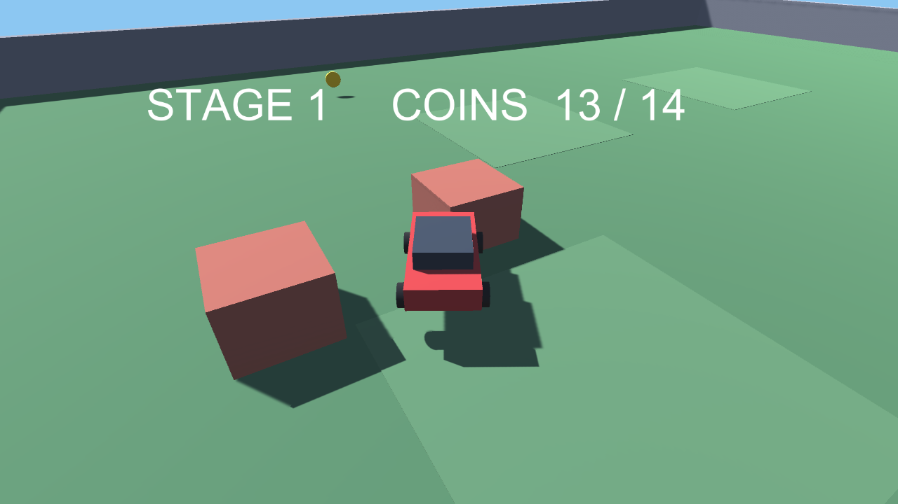

# 🚗 Coin Cruiser

> 3Dカーでアリーナを駆け回り、16枚のコインをすべて集めよう。

3Dのアリーナ内で車を操作し、配置された16枚のコインをすべて回収するブラウザゲームです。Unity で開発され、WebGL ビルドを GitHub Pages 上で公開しています。


🔗 **[Live Demo](https://masafykun.github.io/coin-cruiser/)**

---

## 📸 スクリーンショット


---

## 🎮 操作方法
| 操作 | 動作 |
|---|---|
| W / ↑ | 前進 |
| S / ↓ | 後退 |
| A / ← | 左へステア |
| D / → | 右へステア |

---

## ✨ 特徴
- **3Dカー操作** — アリーナ内で車を自由に走らせて探索できる
- **コイン収集** — 配置された16枚のコインをすべて集めるとクリア
- **ブラウザで即プレイ** — WebGL ビルドにより GitHub Pages 上で直接プレイ可能

---

## 🛠️ 技術スタック
| カテゴリ | 技術 |
|---|---|
| エンジン | Unity (6000.0.77f1) |
| 言語 | C# |
| 配信 | WebGL / GitHub Pages |

---

## 🚀 セットアップ
```bash
# ブラウザで直接プレイする場合
# https://masafykun.github.io/coin-cruiser/ にアクセス

# ローカルで WebGL ビルドを開く場合
# index.html を簡易 HTTP サーバー経由で開く
python3 -m http.server 8000
# ブラウザで http://localhost:8000 を開く
```

C# のソースコードは `src/` 配下にあります。

---

## ライセンス
[](https://opensource.org/licenses/MIT)

このプロジェクトは **MIT ライセンス** のもとで公開しています。

© 2026 masafykun (https://github.com/masafykun)
